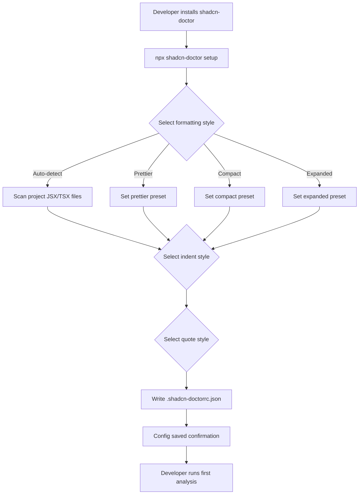
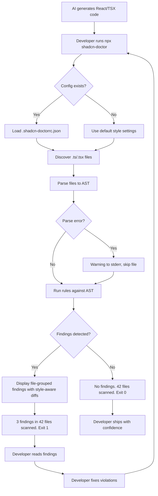
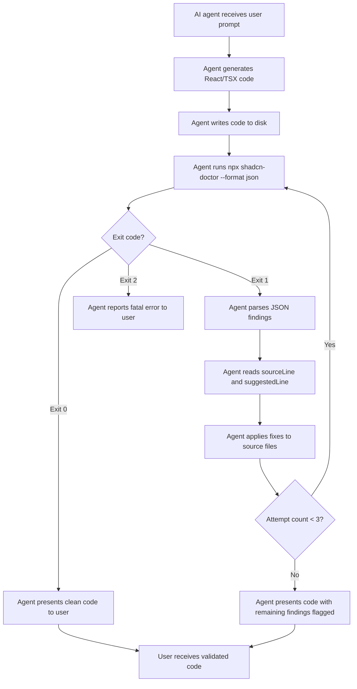
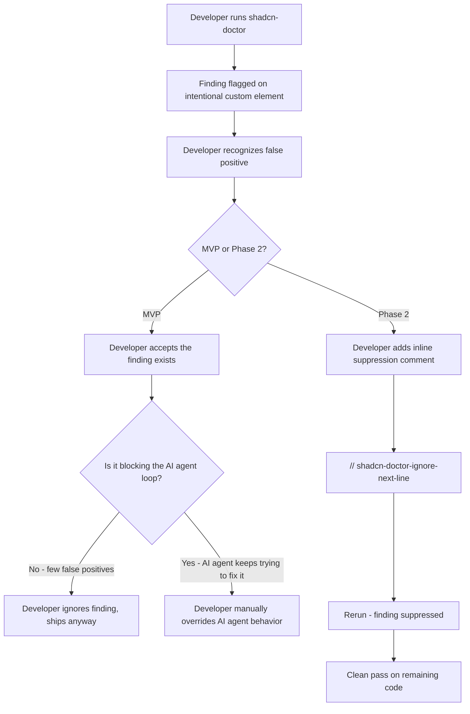

# UX Design Specification shadcn-doctor

**Author:** James
**Date:** 2026-03-28

---

## Executive Summary

### Project Vision

shadcn-doctor is a CLI static analysis tool that detects missed shadcn/ui component adoption in React/TSX codebases. Its UX is entirely text-based — the "interface" is CLI output consumed by two distinct audiences: human developers reading terminal output, and AI agents parsing structured JSON. The tool's UX goal is to make design system compliance feel effortless by producing output so clear and actionable that neither audience needs to think twice about what to do next.

### Target Users

**Primary — AI Agent Developers:** Engineers building AI coding assistants who need a deterministic quality gate for shadcn/ui compliance. They integrate shadcn-doctor into their agent's pipeline and never see the output directly — their agent does.

**Secondary — Frontend Developers:** Developers like James who use AI coding tools daily and want to trust AI-generated code without a manual cleanup pass. They see human-readable terminal output after running the tool directly.

**Tertiary — AI Agents (Machine Consumers):** The AI agents themselves, consuming JSON output in autonomous fix-and-rerun loops. They need structured, stable, deterministic data with enough context to fix each finding without human interpretation.

### Key Design Challenges

1. **Dual-audience output design:** Human-readable and machine-readable formats must each be optimized for their audience while representing identical information. Human output needs visual hierarchy and scannability; JSON output needs schema stability and completeness.

2. **Trust through precision:** Every finding must feel obviously correct. Vague or debatable findings undermine the tool's core promise of "trust the pass/fail result." Output messaging must be specific, concrete, and immediately verifiable.

3. **Information density management:** CLI output for large codebases with many findings must remain scannable — avoiding wall-of-text fatigue while preserving the detail needed for each finding to be independently actionable.

### Design Opportunities

1. **Test-runner pattern familiarity:** Mimicking output conventions from Jest, Vitest, and ESLint eliminates the learning curve. Developers already know how to read pass/fail output with file-grouped findings.

2. **Zero-friction onboarding:** One command, two flags, two exit codes. The CLI's simplicity means the UX challenge is entirely in output quality, not in interaction complexity.

3. **Actionable-by-default findings:** Every finding includes a specific shadcn/ui replacement suggestion — not just "this is wrong" but "use this instead." This is a concrete UX advantage over generic static analysis tools.

## Core User Experience

### Defining Experience

The core user interaction with shadcn-doctor is a single command invocation followed by reading (human) or parsing (AI agent) the result. The entire experience is: run, read, act. There are no multi-step flows, no configuration wizards, no dashboards. The tool's UX quality is determined entirely by the clarity, precision, and actionability of its terminal output.

For human users, the experience is: invoke the tool, scan the output for findings grouped by file, understand each violation at a glance, and either fix or ship. For AI agents, the experience is: invoke the tool, parse JSON, apply fixes, rerun until exit code 0.

### Platform Strategy

- **Platform:** Terminal/CLI only — all major operating systems (macOS, Linux, Windows)
- **Input method:** Keyboard — command invocation with optional flags
- **Output medium:** stdout (findings and results) and stderr (warnings only)
- **Integration surface:** Exit codes (0/1/2) for CI/CD and automation pipelines
- **Network:** None required — purely local static analysis, always works offline
- **Dependencies:** Node.js 18+ runtime only

### Effortless Interactions

- **Zero configuration:** Run `npx shadcn-doctor` and get useful results immediately. No setup, no config files, no project-specific tuning required for MVP.
- **Self-explanatory findings:** Each finding includes the file, line number, what's wrong, and what to use instead. No need to look up rule documentation.
- **Familiar output patterns:** Test-runner style output that any developer can read without learning a new format.
- **Trivial automation:** Standard exit codes and JSON output make CI integration a one-liner.

### Critical Success Moments

1. **First run trust:** The moment a user sees findings and every single one is a legitimate missed shadcn/ui opportunity — no false positives, no debatable calls. This is when the tool earns the right to be trusted.
2. **Clean pass confidence:** When the tool exits 0, the user ships without second-guessing. The absence of findings is as meaningful as their presence.
3. **AI agent loop closure:** The first time an AI agent runs, fixes, reruns, and achieves exit code 0 autonomously — proving the output is machine-actionable without human interpretation.
4. **Zero-learning onboarding:** A developer runs the tool for the first time and immediately understands the output without reading any documentation.

### Experience Principles

1. **Output is the interface:** Every UX decision is an output formatting decision. There are no screens, menus, or settings panels. The quality of terminal output IS the product experience.
2. **Actionable over informative:** Every finding tells the user exactly what to do, not just what's wrong. Specific replacement suggestions, not generic warnings.
3. **Trust by default:** The tool earns trust through precision and conservatism. A clean pass means ship confidently. A finding means a real problem exists. No grey areas, no advisory noise.
4. **Invisible integration:** The tool feels like it was always part of the workflow. Familiar output conventions, standard exit codes, zero config. Nothing new to learn.

## Desired Emotional Response

### Primary Emotional Goals

**Confidence:** Users trust the tool's judgment completely. When it reports a finding, it's real. When it passes, the code is clean. No second-guessing required.

**Relief:** The tool removes the cognitive burden of manually checking AI-generated code for shadcn/ui compliance. Users feel freed from tedious review work.

**Invisibility:** The tool becomes so natural in the workflow that users notice its absence, not its presence. It demands zero emotional energy during normal operation.

### Emotional Journey Mapping

| Stage | Desired Emotion | What Triggers It |
|---|---|---|
| Discovery | Recognition — "this is my exact problem" | Clear product description that names the pain precisely |
| First run (findings) | Trust — "every one of these is legitimate" | High-precision findings with zero obvious false positives |
| Fix and rerun (clean pass) | Certainty — "I can ship this now" | Clean pass with clear summary, decisive exit code 0 |
| Ongoing use | Invisibility — "just part of the workflow" | Zero-config, consistent behavior, no surprises |
| False positive encountered | Tolerance — "a miss, but I still trust the rest" | Low false positive rate (<5%) preserves overall credibility |
| Error / malformed file | Calm — "it handled that gracefully" | Warning on stderr, process continues, no crash |

### Micro-Emotions

**Prioritized emotional states:**

- **Confidence over confusion:** Output is immediately clear. Every finding is self-explanatory. No ambiguity about what's wrong or what to do.
- **Trust over skepticism:** Conservative matching means every finding feels earned. The tool never cries wolf.
- **Relief over frustration:** The tool catches things so the developer doesn't have to. It removes work, never adds it.
- **Closure over uncertainty:** A clean pass is definitive. There's no "maybe there are more issues" anxiety.

### Design Implications

| Emotional Goal | UX Design Choice |
|---|---|
| Confidence | Specific, concrete finding messages — never vague or generic |
| Trust | Conservative detection — when in doubt, don't flag it |
| Relief | Actionable suggestions with every finding — always tell users what to do |
| Invisibility | Zero config, familiar output patterns, standard exit codes |
| Closure | Clear pass/fail summary at the end of every run |
| Tolerance (on false positives) | Keep false positive rate under 5% so occasional misses don't break trust |

### Emotional Design Principles

1. **Earn trust, don't demand it:** Trust comes from precision, not from claiming authority. Every finding must justify itself through specificity.
2. **Remove work, never add it:** If a finding creates more questions than answers, the UX has failed. Each finding must be a net reduction in developer effort.
3. **Silence is golden:** A clean pass should feel satisfying and conclusive, not anticlimactic. The absence of output is itself a positive signal.
4. **Graceful imperfection:** When the tool is wrong (false positive) or encounters a problem (malformed file), the response should feel measured and professional — a warning, not a crash.

## UX Pattern Analysis & Inspiration

### Inspiring Products Analysis

**ESLint — Static Analysis Output Standard**
The most directly relevant inspiration. ESLint established the conventions developers expect from static analysis tools: findings grouped by file, rule IDs for each violation, line:column references, and `--format json` for machine consumption. Its output format is so widely adopted that deviating from it would create friction. Key UX lesson: don't innovate on output structure — match what developers already know how to read.

**Vitest / Jest — Test Runner Visual Hierarchy**
Test runners perfected the art of making pass/fail results feel satisfying. Green checkmarks, red X's, color-coded output, and a clear summary line at the bottom ("X passed, Y failed"). The "all green" feeling on a clean run is genuinely rewarding. Key UX lesson: visual hierarchy through symbols and color makes large output sets scannable at a glance, and a clean pass should feel like a small victory.

**TypeScript Compiler (tsc) — Trust Through Strictness**
When `tsc` reports an error, developers don't question it — they fix it. This absolute trust comes from deterministic, precise output with zero advisory noise. It uses the `file:line:column` format universally understood by editors and tools. Key UX lesson: trust is built by never being wrong, not by explaining yourself. Precision eliminates the need for verbosity.

### Transferable UX Patterns

**Output Structure Patterns:**
- **File-grouped findings** (ESLint) — Group findings by file path, not by rule. Developers think in files, not in rule categories.
- **line:column references** (tsc) — Exact location format that editors, IDEs, and AI agents can all parse.
- **Summary footer** (Vitest) — End every run with a one-line summary: total files scanned, total findings, pass/fail status.

**Interaction Patterns:**
- **Exit codes as API** (all three) — 0 for success, non-zero for failure. The simplest possible integration contract.
- **Format flag** (ESLint) — `--format json` for machines, human-readable by default. Two audiences, one flag.
- **Zero-config default** (tsc) — Works immediately with sensible defaults. Configuration is opt-in, not required.

**Visual Patterns:**
- **Pass/fail symbols** (Vitest) — Use checkmarks and X marks for instant visual scanning.
- **Color coding** (all three) — Red for findings, green for clean, yellow for warnings. Standard terminal color semantics.
- **Indented detail** (ESLint) — File path as header, indented findings beneath. Creates natural visual grouping.

### Anti-Patterns to Avoid

- **ESLint warning noise:** ESLint's warning severity level creates output that's neither pass nor fail — developers learn to ignore warnings entirely. shadcn-doctor should avoid advisory output in MVP. Every finding is a fail. No warnings-that-aren't-errors.
- **Verbose explanations per finding:** Some tools include multi-line explanations, documentation links, or fix examples inline. This creates wall-of-text fatigue. Keep each finding to one line with a clear suggestion.
- **Unstable output ordering:** Tools that produce different output order on identical input break AI agent fix loops and make diff-based workflows unreliable. Deterministic ordering is non-negotiable.
- **Missing context in JSON:** Some tools produce JSON that requires a human to interpret (e.g., error codes without descriptions). JSON output must be self-contained — every field an AI agent needs to fix the issue must be present.

### Design Inspiration Strategy

**Adopt directly:**
- ESLint's file-grouped, indented finding structure — it's the industry standard
- Vitest's summary footer with pass/fail count and visual symbols
- tsc's file:line:column location format
- Standard exit codes (0 = pass, 1 = fail, 2 = error)

**Adapt for shadcn-doctor:**
- Add a `suggestion` field to every finding (ESLint doesn't always suggest fixes) — this is shadcn-doctor's UX advantage
- Simplify ESLint's multi-severity system to binary pass/fail only — no warnings, no "off" state
- Include `element` and `replacement` fields in JSON that ESLint doesn't provide — specific to design system context

**Avoid:**
- Warning severity levels that create ignorable noise
- Multi-line finding explanations that reduce scannability
- Configuration complexity that breaks zero-config promise
- Output formats that require documentation to interpret

## Design System Foundation

### Design System Choice

**CLI Output Convention System** — No external UI design system. shadcn-doctor's "design system" is the set of terminal output formatting conventions derived from established CLI tools (ESLint, Vitest, tsc). This is the appropriate choice for a tool with no graphical interface whose entire UX surface is terminal text output.

### Rationale for Selection

- **No visual UI exists:** shadcn-doctor has no web pages, no desktop windows, no mobile screens. Traditional design systems (Material, Chakra, etc.) are irrelevant.
- **Terminal conventions are the standard:** Developers already have deep muscle memory for reading CLI output. The "design system" is ANSI colors, Unicode symbols, and indentation-based hierarchy.
- **Zero dependencies:** Output formatting requires no external libraries. ANSI escape codes and Unicode characters are universally supported in modern terminals.
- **Proven by inspiration analysis:** ESLint, Vitest, and tsc have already validated these output patterns with millions of developers.

### Implementation Approach

**Design Tokens (Terminal):**

| Token | Value | Usage |
|---|---|---|
| Color: Error | Red (ANSI 31) | Finding violations, fail status |
| Color: Success | Green (ANSI 32) | Clean pass status, checkmarks |
| Color: Warning | Yellow (ANSI 33) | File parse warnings, skipped files |
| Color: Muted | Dim/Gray (ANSI 2) | Secondary information (rule IDs, line numbers) |
| Color: File Path | White/Bold (ANSI 1) | File path headers |
| Symbol: Pass | Unicode checkmark | Clean file or clean run indicator |
| Symbol: Fail | Unicode X mark | Finding indicator |
| Symbol: Warning | Unicode warning triangle | Parse warning indicator |
| Indentation | 2 spaces | Finding detail beneath file headers |

**Output Components:**

| Component | Structure | Example |
|---|---|---|
| File Header | Bold file path, standalone line | `src/pages/settings.tsx` |
| Finding Line | Indent + line:col + violation + suggestion | `  24:5  Raw <select> detected. Use <Select> from shadcn/ui  prefer-shadcn-select` |
| Summary Footer | Newline + symbol + counts + pass/fail | `X 3 findings in 42 files scanned` |
| Clean Pass | Symbol + message | `✓ No findings. 42 files scanned.` |
| Warning Line | Symbol + message (stderr) | `⚠ Skipped malformed file: src/broken.tsx` |

### Customization Strategy

**MVP:** No customization. Output follows the conventions above exactly. Color output is enabled by default and respects `NO_COLOR` environment variable (standard CLI convention).

**Phase 2 considerations:**
- `--no-color` flag for environments that don't support ANSI codes
- Potential `--verbose` flag for additional context per finding
- Custom formatters via `--format` extensibility

## Defining User Experience

### Defining Experience

**"Run one command, get a verdict you trust."**

The defining experience of shadcn-doctor is not the command invocation — that's trivial. It's the moment the user reads the output and immediately knows what to do, or knows there's nothing to do. The trust in that verdict is the entire product. Every design decision flows from making that moment feel instant, precise, and conclusive.

For human developers: run, scan output, fix or ship. For AI agents: run, parse JSON, fix or confirm clean. Both audiences reach the same conclusion through different output formats in the same interaction cycle.

### User Mental Model

Developers bring the mental model of `npm test` or `tsc --noEmit` to shadcn-doctor:

- **Binary expectation:** Run a command, get pass or fail. No "maybe," no advisory warnings.
- **Fixable problems:** If fail, expect a list of specific issues with file locations and clear remediation.
- **Confirmation on pass:** If pass, a brief confirmation and done. No verbose success output.
- **Repeatability:** Same code, same result, every time.

**Mental model shift:** Developers currently check AI-generated code manually — scanning for raw HTML elements where shadcn/ui should be used. This is slow, error-prone, and breaks flow state. shadcn-doctor's mental model shift is: "I don't need to check anymore." The tool checks. If it passes, ship it.

**AI agent mental model:** AI agents treat shadcn-doctor like a test suite. Run after generation, parse structured output, apply fixes, rerun until exit code 0. The mental model is a deterministic feedback loop, not a recommendation engine.

### Success Criteria

| Criteria | Measurement |
|---|---|
| Instant comprehension | A developer understands every finding in the output without re-reading any line |
| Zero-lookup actionability | Every finding includes enough context to fix it without consulting docs or source |
| Trust on first use | First-time user sees zero false positives in their initial run |
| Loop closure | AI agent achieves exit code 0 within 3 fix-and-rerun cycles for typical violations |
| Speed invisibility | Execution is fast enough that the user never thinks about performance (sub-5s) |
| Clean pass satisfaction | A clean pass feels conclusive — the user ships without second-guessing |

### Novel UX Patterns

**Established patterns adopted (no innovation needed):**
- CLI invocation with path argument and flags — universal developer convention
- File-grouped findings with line:column references — ESLint standard
- Pass/fail exit codes — Unix convention
- JSON output via format flag — established in ESLint, Prettier, and other tools
- Summary footer with counts — test runner convention

**Adapted pattern (shadcn-doctor's unique twist):**
- **Suggestion-first findings:** Every finding includes a specific shadcn/ui replacement, not just a violation description. This goes beyond what most linters provide. The finding format is: what's wrong + where + what to use instead. This is the UX differentiator — findings that are complete instructions, not diagnostic clues.

**No novel patterns required.** shadcn-doctor succeeds by executing established CLI conventions flawlessly, not by inventing new ones. The innovation is in what the tool detects, not in how it presents results.

### Experience Mechanics

**1. Initiation:**
- User types `npx shadcn-doctor [path]` or `npx shadcn-doctor` (defaults to cwd)
- Optional `--format json` flag for machine-readable output
- No setup, no config, no prerequisite commands

**2. Processing:**
- Tool runs silently — no progress bars, no spinners, no incremental output
- Sub-5-second execution means the user barely waits
- Processing is invisible; only the result matters

**3. Result — Findings Detected (Exit Code 1):**
- File paths as bold headers, one per file with findings
- Indented finding lines beneath each file: `line:col  violation message  rule-id`
- Each finding includes the specific shadcn/ui replacement suggestion
- Summary footer: total findings count and files scanned

**4. Result — Clean Pass (Exit Code 0):**
- Single line: checkmark + "No findings" + files scanned count
- Nothing more. Brevity IS the positive feedback.

**5. Result — Fatal Error (Exit Code 2):**
- Clear error message to stderr (e.g., "Path not found: ./nonexistent")
- No findings output — just the error

**6. Completion:**
- Exit code signals done — developer either fixes and reruns, or ships
- No "next steps" suggestions, no promotional output, no telemetry notices
- The tool exits cleanly and gets out of the way

## Visual Design Foundation

### Color System

**ANSI Terminal Color Palette:**

shadcn-doctor uses standard ANSI color codes exclusively — no 256-color or true-color extensions, ensuring maximum terminal compatibility.

| Role | ANSI Code | Application |
|---|---|---|
| Error/Finding | Red (31) | Violation messages, fail symbol, fail summary |
| Success | Green (32) | Pass symbol, pass summary message |
| Warning | Yellow (33) | Parse warning symbol and messages (stderr) |
| File Path | Bold (1) | File path headers — bold white stands out as section separators |
| Rule ID | Dim (2) | Rule IDs at end of finding lines — present but visually secondary |
| Location | Dim (2) | Line:column numbers — scannable but not competing with violation text |
| Default | Reset (0) | Violation and suggestion text — standard terminal foreground |

**Color independence:** Every piece of information is conveyed by text content and symbols, not just color. A colorblind developer or `NO_COLOR` environment loses visual hierarchy but retains all information. Symbols (checkmark, X, warning triangle) carry meaning independently of color.

**`NO_COLOR` compliance:** Respect the `NO_COLOR` environment variable (https://no-color.org/). When set, suppress all ANSI codes. Output remains fully functional and readable without color.

### Typography System

**Font:** Terminal monospace — no choice, no customization. All visual hierarchy is achieved through indentation, symbols, and ANSI formatting (bold, dim).

**Information Density Per Finding Line:**

```
  24:5  Raw <select> element detected. Use <Select> from shadcn/ui  prefer-shadcn-select
  ^---^ ^---------------------------------------------------^  ^--------------------^
  dim    default (violation + suggestion in one sentence)        dim (rule ID)
```

**Line composition rules:**
- Finding lines target under 120 characters to avoid wrapping in standard terminal widths (80-120 cols)
- Violation and suggestion are combined into a single natural sentence, not two separate fields
- Rule ID is right-aligned or appended at end, dimmed — it's metadata, not the message
- No line wrapping logic in MVP — if a line exceeds terminal width, the terminal handles wrapping naturally

**Text hierarchy (achieved without fonts):**
1. **Bold** — File path headers (highest visual weight)
2. **Default** — Violation + suggestion text (primary reading content)
3. **Dim** — Line:column, rule IDs (secondary reference information)

### Spacing & Layout Foundation

**Vertical rhythm:**

```
                                          ← one blank line before first file group
src/pages/settings.tsx                    ← bold file header
  24:5   Raw <select> detected...         ← indented finding (2 spaces)
  41:3   Raw <button> detected...         ← indented finding (2 spaces)
                                          ← one blank line between file groups
src/components/form.tsx                   ← bold file header
  12:7   Raw <input> detected...          ← indented finding (2 spaces)
                                          ← one blank line before summary
✗ 3 findings in 42 files scanned         ← summary footer
```

**Spacing rules:**
- **2-space indent** for findings beneath file headers — enough to create visual grouping without wasting horizontal space
- **1 blank line** between file groups — separates files clearly without excessive whitespace
- **1 blank line** before summary footer — visually separates the verdict from the findings
- **No blank lines** between findings within the same file — keeps related findings tight
- **No trailing blank line** after summary — clean exit

**Clean pass output (minimal):**

```
✓ No findings. 42 files scanned.
```

One line. No blank lines before or after. Brevity is the reward.

### Accessibility Considerations

- **`NO_COLOR` support:** Full compliance with the no-color.org standard. All ANSI codes suppressed when `NO_COLOR` environment variable is set.
- **Symbol-based semantics:** Checkmark (pass), X (fail), and warning triangle carry meaning independently of color. Screen readers and colorblind users get the same signal.
- **No reliance on background colors:** Output uses foreground colors and formatting only. Works on light and dark terminal themes.
- **Readable without formatting:** Strip all ANSI codes and the output remains a valid, readable report. Indentation and line structure carry the layout, not color.
- **Standard contrast:** ANSI colors are rendered by the user's terminal theme. By using semantic ANSI codes (red, green, yellow) rather than specific RGB values, shadcn-doctor inherits the user's contrast preferences automatically.

## Design Direction Decision

### Design Directions Explored

Six output formatting directions were evaluated for the human-readable output:

1. **ESLint-Style (Dense)** — Terse, symbolic, file-grouped. Familiar but reads as shorthand.
2. **Vitest-Style (Symbolic)** — FAIL/PASS labels, checkmark/X per finding. Adds visual noise.
3. **Compact (Minimal)** — One line per finding, no file grouping. Loses scannability.
4. **Descriptive (Verbose)** — Multi-line per finding with labeled fields. Too verbose, wall-of-text risk.
5. **Natural Language** — Sentence-based findings, file-grouped. Readable by humans and AI alike.
6. **Natural Language + Line Diff** — Direction 5 plus git-style `-/+` showing the detected source line and style-aware suggested replacement.

### Chosen Direction

**Direction 6: Natural Language + Style-Aware Line Diff**

The output combines natural language finding messages with git-style diffs where the suggested replacement conforms to the project's configured code formatting style.

**Findings output (with style-aware suggestions):**
```
src/pages/settings.tsx
  24:5  Raw <select> detected. Use <Select> from shadcn/ui.  prefer-shadcn-select
  - <select className="border rounded p-2" onChange={handleChange}>
  + <Select onValueChange={handleChange}>

  41:3  Raw <button> detected. Use <Button> from shadcn/ui.  prefer-shadcn-button
  - <button className="bg-blue-500 text-white px-4 py-2 rounded" onClick={save}>
  + <Button onClick={save}>

src/components/form.tsx
  12:7  Raw <input> detected. Use <Input> from shadcn/ui.  prefer-shadcn-input
  - <input type="text" className="border rounded px-3 py-2" value={name} onChange={setName} />
  + <Input type="text" value={name} onChange={setName} />

3 findings in 42 files scanned.
```

**Multi-line style example (expanded preset):**
```
src/pages/settings.tsx
  24:5  Raw <select> detected. Use <Select> from shadcn/ui.  prefer-shadcn-select
  - <select className="border rounded p-2" onChange={handleChange}>
  + <Select
  +   onValueChange={handleChange}
  + >

3 findings in 42 files scanned.
```

**Clean pass:**
```
No findings. 42 files scanned.
```

**JSON output** (`--format json`) includes style-aware suggestions:
```json
{
  "pass": false,
  "summary": { "total": 3, "filesScanned": 42 },
  "findings": [
    {
      "file": "src/pages/settings.tsx",
      "line": 24,
      "column": 5,
      "rule": "prefer-shadcn-select",
      "violation": "Raw <select> detected. Use <Select> from shadcn/ui.",
      "element": "select",
      "replacement": "Select",
      "sourceLine": "<select className=\"border rounded p-2\" onChange={handleChange}>",
      "suggestedLine": "<Select onValueChange={handleChange}>"
    }
  ],
  "warnings": []
}
```

### Setup Command UX

**`npx shadcn-doctor setup` — Interactive one-time configuration:**

```
shadcn-doctor setup

? Select your formatting style:
  ❯ Auto-detect (scan your project)
    Prettier (threshold-based wrapping at print width)
    Compact (single-line when possible)
    Expanded (always multi-line attributes)

? Indent style:
  ❯ Spaces (2)
    Spaces (4)
    Tabs

? Quote style:
  ❯ Double quotes
    Single quotes

✓ Config saved to .shadcn-doctorrc.json
```

**Generated `.shadcn-doctorrc.json`:**
```json
{
  "style": "prettier",
  "indent": 2,
  "quotes": "double",
  "printWidth": 80
}
```

**Setup UX principles:**
- Interactive prompts with sensible defaults (prettier, 2-space, double quotes)
- Auto-detect option scans existing JSX/TSX files and infers the project's formatting conventions
- Config file lives in project root — committed to repo so the whole team shares the same style
- Running `setup` again overwrites the existing config (with confirmation)
- The setup command is the recommended first step — but `npx shadcn-doctor` works without it using defaults

**Two-command mental model:**
1. `npx shadcn-doctor setup` — Configure once (like `git init` or `eslint --init`)
2. `npx shadcn-doctor [path]` — Analyze with style-aware suggestions

### Design Rationale

- **Natural language findings** serve both audiences: developers read them as code review comments, AI agents parse them as plain English instructions.
- **Style-aware line diffs** make every finding copy-paste ready. Suggestions match the project's code style so developers don't need to reformat and AI agents can apply fixes directly.
- **Setup command** establishes formatting preferences upfront — enforcing consistent code style is the same philosophy as enforcing correct shadcn/ui usage. The tool trains users toward consistency on both fronts.
- **Git diff format (`-/+`)** is universally recognized — zero learning curve.
- **File grouping** maintained from ESLint convention — developers think in files.
- **Auto-detect** option reduces friction for projects with established formatting — no manual configuration needed.

### Implementation Approach

**CLI commands:**
- `npx shadcn-doctor setup` — Interactive setup, creates `.shadcn-doctorrc.json`
- `npx shadcn-doctor [path]` — Analyze with style-aware suggestions
- `npx shadcn-doctor [path] --format json` — JSON output with style-aware suggestions

**Config resolution order:**
1. `.shadcn-doctorrc.json` in project root (if exists)
2. Default style (prettier, 2-space indent, double quotes, 80 print width)

**Style-aware suggestion generation:**
- Each rule generates replacement code using the configured style preset
- Compact: single-line elements when under print width
- Expanded: always multi-line with one attribute per line
- Prettier: threshold-based — single-line if short, multi-line if exceeds print width
- Indent and quote settings applied to all generated suggestion lines

**Scope boundary:**
- MVP replacement logic handles element-level swap with style-aware formatting
- Complex structural transformations (e.g., `<select>` + `<option>` children) show opening element swap only
- Auto-detect analyzes a sample of existing JSX files for indent, quotes, and line-length patterns

## User Journey Flows

### Journey 0: First-Time Setup

**Goal:** Developer configures shadcn-doctor for their project in under 60 seconds.



**Flow details:**
- **Entry point:** `npx shadcn-doctor setup` — developer runs after installing or as first command
- **Decision points:** 3 prompts (style, indent, quotes) — each has a sensible default pre-selected
- **Auto-detect path:** Tool scans existing JSX/TSX files, infers formatting conventions, shows what it detected, asks for confirmation
- **Success moment:** "Config saved to .shadcn-doctorrc.json" — developer immediately runs their first analysis
- **Error recovery:** If no JSX/TSX files found for auto-detect, falls back to manual selection with a message: "No JSX/TSX files found to analyze. Select a style manually."
- **Re-run behavior:** Running `setup` again detects existing config and asks "Overwrite existing config? (y/n)"

### Journey 1: Developer Analyze Flow (The Daily Build)

**Goal:** Developer runs shadcn-doctor on AI-generated code, gets actionable findings, fixes and ships.



**Flow details:**
- **Entry point:** `npx shadcn-doctor [path]` — typically after AI generates or modifies code
- **Config resolution:** Checks for `.shadcn-doctorrc.json` silently — no message if not found, just uses defaults
- **File discovery:** Recursive scan, alphabetical sort, .ts/.tsx only
- **Parse errors:** Warning to stderr per file, process continues — never crashes on bad input
- **Findings output:** Natural language messages with style-aware `-/+` diffs, grouped by file
- **Fix-rerun loop:** Developer fixes issues (often by telling the AI to fix them), reruns until clean
- **Success moment:** Clean pass — "No findings. 42 files scanned." Developer ships.
- **Typical loop count:** 1-2 iterations for well-prompted AI agents, 2-3 for less precise ones

### Journey 2: AI Agent Autonomous Loop

**Goal:** AI agent validates and self-corrects shadcn/ui usage without human intervention.



**Flow details:**
- **Entry point:** AI agent invokes `npx shadcn-doctor [path] --format json` programmatically
- **JSON parsing:** Agent reads `pass` boolean for quick status, then iterates `findings` array
- **Fix application:** Agent uses `sourceLine` and `suggestedLine` fields to apply replacements directly — no code generation needed
- **Retry limit:** 3 attempts maximum. If findings remain after 3 cycles, agent presents code to user with unresolved findings transparently flagged.
- **Fatal error handling:** Exit code 2 (e.g., path not found) — agent reports the error message to user rather than silently failing
- **Success moment:** Exit code 0 on rerun — agent confirms clean code and presents to user
- **Determinism guarantee:** Same source always produces same findings — agent can trust that fixing a finding and rerunning will show progress

### Journey 3: False Positive Handling

**Goal:** Developer encounters a false positive and needs to proceed without losing trust in the tool.



**Flow details:**
- **Entry point:** Developer sees a finding that flags intentional custom code (e.g., custom animation `<div>` flagged as missed `<Card>`)
- **MVP mitigation:** The <5% false positive rate means this is rare. When it happens, the finding doesn't block shipping — the developer can choose to ignore it. The emotional response should be tolerance, not frustration.
- **AI agent impact:** If an AI agent encounters a false positive, it may waste a retry cycle trying to "fix" it. The 3-attempt retry limit prevents infinite loops. After 3 attempts, the agent flags remaining findings for human review.
- **Phase 2 resolution:** Inline suppression comments (`// shadcn-doctor-ignore-next-line`) allow permanent suppression of known false positives.
- **Trust preservation:** The tool's credibility depends on false positives being rare enough that one miss doesn't undermine overall trust. The conservative matching principle in rule design is the primary defense.

### Journey Patterns

**Common patterns across all journeys:**

**Invocation Pattern:**
- Every journey starts with a single CLI command
- Config is resolved silently — no "loading config" messages
- File discovery is implicit — the user provides a path or defaults to cwd

**Feedback Pattern:**
- Findings: natural language + style-aware diff (human) or structured JSON (machine)
- Clean pass: minimal one-line confirmation
- Errors: clear message to stderr, appropriate exit code
- Warnings: stderr only, never mixed into findings output

**Loop Pattern:**
- Both human and AI agent journeys follow the same fix-rerun loop
- Exit code is the universal signal for loop continuation or termination
- Each iteration should show measurable progress (fewer findings)

**Graceful Degradation Pattern:**
- No config → defaults work fine
- Parse error → skip file with warning, continue
- False positive → rare enough to tolerate, Phase 2 adds suppression
- AI agent can't fix → transparently flag remaining issues for human

### Flow Optimization Principles

1. **Minimize time-to-first-result:** No setup required for analysis. `npx shadcn-doctor` works immediately. Setup is recommended but not required.
2. **Single command, single result:** Every invocation produces one complete result. No partial output, no streaming, no "processing..." messages.
3. **Exit code as API:** The exit code is the most important output. Everything else (findings, summary) is context for the exit code decision.
4. **Progressive trust building:** First run establishes trust (precise findings). Subsequent runs reinforce it (consistent, deterministic). Over time, the developer stops checking and just trusts the verdict.
5. **Fail fast on fatal errors:** If the target path doesn't exist or no files are found, exit immediately with code 2 and a clear error. Don't attempt partial analysis.

## Component Strategy

### Design System Components

shadcn-doctor's "component library" is the set of terminal output building blocks. These are not UI widgets — they are standardized text patterns that compose all CLI output.

**Defined Output Components:**

| Component | Purpose | Format |
|---|---|---|
| File Header | Groups findings by file | Bold file path on standalone line |
| Finding Line | Reports a single violation | `  line:col  Natural language message.  rule-id` |
| Diff Source Line | Shows detected code | `  - <element attributes...>` (red) |
| Diff Suggestion Line | Shows replacement code | `  + <Component attributes...>` (green) |
| Summary Footer | Reports overall result | `N findings in N files scanned.` or `No findings. N files scanned.` |
| Warning Line | Reports non-fatal issues | `⚠ message` (yellow, stderr) |
| Error Message | Reports fatal errors | Plain text error description (stderr) |
| JSON Output | Machine-readable full result | Structured JSON to stdout |

### Custom Components

**Setup Prompt Components (Journey 0):**

These components are unique to the `setup` command and use an interactive prompt library (e.g., @inquirer/prompts).

#### Selection Prompt

**Purpose:** Let user choose from a list of formatting options.
**Anatomy:**
```
? Select your formatting style:
  ❯ Auto-detect (scan your project)
    Prettier (threshold-based wrapping at print width)
    Compact (single-line when possible)
    Expanded (always multi-line attributes)
```
**States:**
- Default: first option pre-selected with `❯` indicator
- Navigation: arrow keys move `❯` between options
- Selected: user presses Enter, prompt collapses to show chosen value
**Interaction:** Arrow keys to navigate, Enter to confirm. No typing required.

#### Auto-Detect Feedback

**Purpose:** Show user what the tool inferred from their codebase.
**Anatomy:**
```
Scanning project files...
Detected: Prettier style, 2-space indent, double quotes (analyzed 24 files)
? Use detected settings? (Y/n)
```
**States:**
- Scanning: brief "Scanning..." message (no spinner for fast operations)
- Results: one-line summary of what was detected and sample size
- Confirmation: Y/n prompt with sensible default (Y)
**Error state:** "No JSX/TSX files found to analyze. Select a style manually." — falls back to manual selection prompts.

#### Setup Confirmation

**Purpose:** Confirm config was saved successfully.
**Anatomy:**
```
✓ Config saved to .shadcn-doctorrc.json
```
**States:**
- Success: green checkmark + file path
- Overwrite: "Config already exists. Overwrite? (y/N)" before writing
**Post-confirmation:** No further output. Developer proceeds to their first analysis.

### Component Implementation Strategy

**Output Formatter Components:**
- Implemented as pure functions in `src/formatters/`
- Human formatter composes File Header → Finding Lines → Diff Lines → Summary Footer
- JSON formatter produces the structured output object
- Both formatters receive the same `AnalysisResult` data — different rendering only
- ANSI color codes applied by formatter, respecting `NO_COLOR`

**Setup Prompt Components:**
- Implemented using `@inquirer/prompts` (lightweight, modern, ESM-compatible)
- Each prompt is a single function call — no custom prompt UI needed
- Auto-detect logic lives in a separate module, invoked when user selects that option
- Config written as JSON with `fs.writeFile`

**Component Composition Rules:**
- Output components are always composed in the same order: headers → findings → diffs → summary
- No component writes directly to stdout — all output flows through the formatter
- Setup prompts are the only interactive components — analysis output is non-interactive
- Warnings always go to stderr, never mixed into stdout component stream

### Implementation Roadmap

**Phase 1 — MVP Core Components:**

| Priority | Component | Needed For |
|---|---|---|
| 1 | Finding Line + Diff Lines | Journey 1, 2 — core analysis output |
| 2 | File Header + Summary Footer | Journey 1 — human-readable grouping and verdict |
| 3 | JSON Output | Journey 2 — AI agent consumption |
| 4 | Selection Prompt + Confirmation | Journey 0 — setup command |
| 5 | Auto-Detect Feedback | Journey 0 — auto-detect option |
| 6 | Warning Line + Error Message | Journey 1, 3 — error handling |

**Phase 2 — Enhancement Components:**

| Component | Purpose |
|---|---|
| Suppression Comment Parser | Journey 3 — inline `// shadcn-doctor-ignore-next-line` |
| Verbose Finding (optional flag) | Extended context per finding with surrounding code lines |
| Watch Mode Output | Continuous analysis with clear/re-render on file changes |

**Phase 3 — Expansion Components:**

| Component | Purpose |
|---|---|
| IDE Integration Output | VS Code diagnostic format for inline editor feedback |
| Adoption Report | Summary statistics of shadcn/ui adoption across codebase |
| Custom Formatter API | Plugin interface for community-built output formats |

## UX Consistency Patterns

### Feedback Patterns

**Success Feedback (Exit 0):**
```
No findings. 42 files scanned.
```
- Single line, no symbol prefix in human output
- Natural language sentence
- Always includes file count for context
- No celebration, no extra output — brevity is the reward

**Failure Feedback (Exit 1):**
```
3 findings in 42 files scanned.
```
- Summary footer after all findings
- States the fact without judgment — "findings," not "errors" or "problems"
- Always includes both finding count and file count

**Warning Feedback (stderr):**
```
⚠ Skipped: src/broken.tsx (parse error)
```
- Yellow warning symbol prefix
- Always on stderr, never mixed with findings on stdout
- Pattern: `⚠ Skipped: {file path} ({reason})`
- Warnings don't affect exit code

**Fatal Error Feedback (Exit 2):**
```
Error: Path not found: ./nonexistent
```
- "Error:" prefix, plain text
- On stderr only
- Immediate exit, no partial output
- Pattern: `Error: {what went wrong}: {specific detail}`

**Setup Success Feedback:**
```
✓ Config saved to .shadcn-doctorrc.json
```
- Green checkmark prefix
- States what was done and where

### Message Language Patterns

**Finding Message Formula:**
Every finding message follows the same two-sentence structure:

```
Raw <{element}> detected. Use <{Component}> from shadcn/ui.
```

- **Sentence 1:** What was found — "Raw `<element>` detected."
- **Sentence 2:** What to do — "Use `<Component>` from shadcn/ui."
- Always specific — names the exact element and exact replacement
- Always a complete, grammatically correct sentence
- No abbreviations, no shorthand, no codes without context

**Examples across different rules:**
```
Raw <button> detected. Use <Button> from shadcn/ui.
Raw <input> detected. Use <Input> from shadcn/ui.
Raw <select> detected. Use <Select> from shadcn/ui.
Raw <textarea> detected. Use <Textarea> from shadcn/ui.
Custom styled <div> detected. Use <Card> from shadcn/ui.
Custom modal <div> detected. Use <Dialog> from shadcn/ui.
Custom alert <div> detected. Use <Alert> from shadcn/ui.
```

**Message consistency rules:**
- "detected" is always the verb for violations — not "found," "identified," or "flagged"
- "Use" is always the verb for suggestions — not "replace with," "consider," or "try"
- "from shadcn/ui" is always included — never abbreviated to "from shadcn"
- No conditional language — never "consider using" or "you might want to." The tool is declarative.

### Output Structure Patterns

**Analysis output always follows this order:**
1. Blank line (visual separation from command invocation)
2. File groups (file header → findings → diffs), separated by blank lines
3. Blank line before summary
4. Summary footer (single line)

**File group always follows this order:**
1. File path (bold)
2. Finding lines (indented 2 spaces), each followed by:
   - Diff source line (`-`, red)
   - Diff suggestion line (`+`, green)
   - Blank line before next finding

**JSON output always follows this schema:**
```json
{
  "pass": boolean,
  "summary": { "total": number, "filesScanned": number },
  "findings": [ ...Finding objects... ],
  "warnings": [ ...string messages... ]
}
```
- Schema never changes between versions without major version bump
- Fields are never omitted — empty arrays for no findings/warnings
- `pass` is always present as the first field — quick status check

**Empty results:**
- Clean pass: single summary line, no file groups
- No files found: fatal error (exit 2), not a clean pass
- All files unparseable: warnings on stderr, clean pass on stdout (no findings in parseable files = pass)

### Error Handling Patterns

**Principle: Degrade gracefully, fail loudly only on fatal errors.**

| Situation | Behavior | Exit Code |
|---|---|---|
| Target path doesn't exist | `Error: Path not found: {path}` to stderr | 2 |
| No .ts/.tsx files in target | `Error: No TypeScript files found in: {path}` to stderr | 2 |
| Single file fails to parse | `⚠ Skipped: {file} (parse error)` to stderr, continue | 0 or 1 (based on other files) |
| All files fail to parse | Warnings for each file, no findings possible | 0 (no findings detected) |
| Config file malformed | `⚠ Invalid config: .shadcn-doctorrc.json (using defaults)` to stderr, continue with defaults | 0 or 1 |
| Config file missing | Silent — use defaults, no warning | 0 or 1 |
| Rule throws unexpected error | `⚠ Rule error: {rule-id} in {file} (skipped)` to stderr, continue | 0 or 1 |

**Error message consistency:**
- Fatal errors: `Error: {description}: {detail}` — always on stderr, always exit 2
- Warnings: `⚠ {action}: {subject} ({reason})` — always on stderr, never affect exit code
- Never: stack traces, debug output, or internal error codes in user-facing output

### Config Behavior Patterns

**Config resolution is always silent:**
- Config found → load it, no message
- Config not found → use defaults, no message
- Config malformed → warning to stderr, use defaults

**Config never changes analysis behavior, only suggestion formatting:**
- The same violations are detected regardless of config
- Config only affects how the `+` suggestion lines are formatted
- No config options to disable rules in MVP (Phase 2)

**Setup command is idempotent:**
- Running `setup` with existing config prompts for overwrite confirmation
- Auto-detect always re-scans, doesn't cache previous results
- Config file is plain JSON — human-editable without the setup command

**Config portability:**
- `.shadcn-doctorrc.json` is designed to be committed to version control
- Team members share the same formatting preferences
- AI agents read the config the same way humans set it up

## Responsive Design & Accessibility

### Responsive Strategy

**Terminal Width Adaptation:**

shadcn-doctor does not dynamically adapt output to terminal width. This is a deliberate choice:

- Finding lines target under 120 characters but do not hard-wrap
- If a line exceeds terminal width, the terminal handles wrapping natively
- No truncation of file paths, messages, or rule IDs — all information is always present
- This matches the behavior of ESLint, tsc, and other established CLI tools

**Rationale:** Dynamic width detection adds complexity without meaningful UX improvement. Developers with narrow terminals are accustomed to wrapped output. Piped output (to files, CI logs, or other tools) should never be truncated.

**Output Environment Adaptation:**

| Environment | Behavior |
|---|---|
| Interactive terminal (TTY) | Full ANSI colors and formatting |
| Piped output (`| less`, `> file.txt`) | Auto-disable colors (detect non-TTY) |
| CI/CD logs (GitHub Actions, etc.) | Colors enabled if CI environment supports ANSI |
| `NO_COLOR` env var set | All ANSI codes suppressed |
| `FORCE_COLOR` env var set | Colors enabled regardless of TTY detection |

**TTY Detection Rules:**
- Check `process.stdout.isTTY` — if false, suppress colors by default
- Respect `NO_COLOR` (disable) and `FORCE_COLOR` (enable) as overrides
- JSON output (`--format json`) never includes ANSI codes regardless of environment
- Stderr warnings follow the same color rules as stdout

### Breakpoint Strategy

**Not applicable.** shadcn-doctor has no visual layout that reflows at different widths. Terminal output is a single-column, top-to-bottom text stream. The "breakpoint" equivalent — TTY vs non-TTY detection — is covered in the responsive strategy above.

### Accessibility Strategy

**Target: Fully accessible CLI output without formal WCAG compliance level.**

WCAG is designed for visual interfaces. CLI tools have a different accessibility surface. shadcn-doctor's accessibility strategy focuses on:

**1. Screen Reader Compatibility:**
- Output is plain text with Unicode symbols — fully readable by screen readers
- No reliance on color alone to convey meaning — symbols (checkmark, X, warning triangle) carry semantics independently
- File paths, line numbers, and messages are in natural reading order
- JSON output is inherently screen-reader friendly as structured text

**2. Color Independence:**
- Every piece of information is conveyed by text content, not color
- `NO_COLOR` compliance ensures fully functional output without any ANSI codes
- Symbols provide semantic meaning: checkmark (pass), X (fail), warning triangle (warning)
- Dim text (rule IDs, line numbers) is supplementary — removing formatting loses visual hierarchy but retains all information

**3. Cognitive Accessibility:**
- Natural language messages reduce cognitive load — no codes or abbreviations to decode
- Consistent message formula across all rules — learn once, recognize everywhere
- File grouping reduces scanning burden — findings are contextual, not a flat list
- Summary footer provides immediate status without requiring full output comprehension

**4. Motor Accessibility:**
- No interactive elements during analysis — output is passive text
- Setup command uses arrow-key navigation with Enter confirmation — minimal motor demand
- No time-sensitive interactions — no timeouts, no auto-dismiss

### Testing Strategy

**Output Correctness Testing:**
- Unit tests for each output component (finding line, file header, summary, diff lines)
- Integration tests comparing full output against snapshot fixtures
- Tests with and without ANSI codes (`NO_COLOR` environment)
- JSON schema validation tests ensuring stable output structure

**Cross-Platform Testing:**
- CI runs on macOS, Linux, and Windows (Node.js 18+)
- Verify path formatting uses forward slashes on all platforms
- Verify ANSI code behavior across terminal emulators

**Accessibility Testing:**
- Manual verification that output reads correctly with screen readers (VoiceOver on macOS, NVDA on Windows)
- Automated test that all output is meaningful with ANSI codes stripped
- Verify no information is lost when `NO_COLOR` is set

**Environment Testing:**
- TTY detection: verify colors enabled in interactive terminal
- Pipe detection: verify colors disabled when piped to file or another process
- CI environment: verify output is readable in GitHub Actions logs
- JSON output: verify zero ANSI codes in JSON mode regardless of environment

### Implementation Guidelines

**For Output Formatting:**
- Use a color utility (e.g., `picocolors` — tiny, zero-dependency) that respects `NO_COLOR` and `FORCE_COLOR`
- Never hard-code ANSI escape sequences — always use the color utility
- Test output rendering with colors disabled as a first-class scenario
- JSON formatter must never pass through the color utility

**For Setup Command:**
- `@inquirer/prompts` handles keyboard navigation and screen reader announcements natively
- No custom interactive UI — rely on the library's accessibility implementation
- Prompts are sequential, not concurrent — one question at a time

**For Cross-Platform:**
- Use `path.posix.join` for all output paths — forward slashes on all platforms
- Use `fs.readdir` with `{ recursive: true }` — available since Node 18.17
- Test file path output on Windows specifically (backslash normalization)
